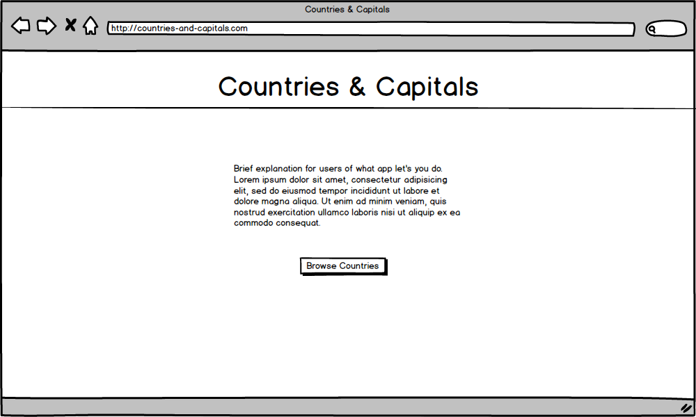
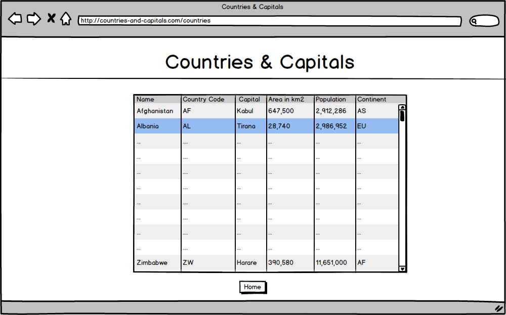
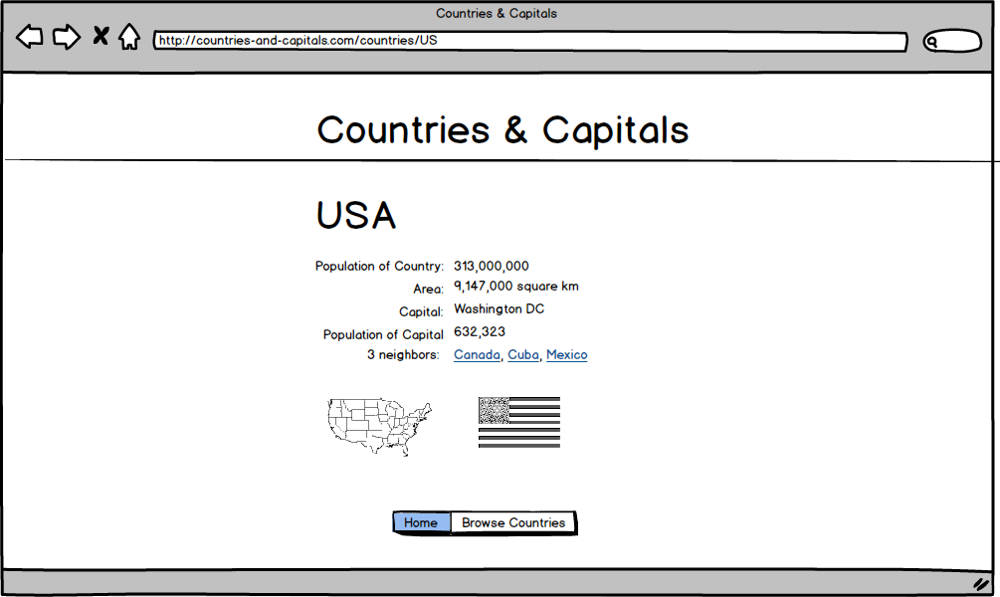

# Capitalia
===========

This application will provide integration with [geonames.org](http://geonames.org) to provide an interface that allows users to explore difference countries and their capitals.

The application will consist of 3 views.

**Index**

This view will show some text explaining to users what the application will do.

**Countries**

* This view will show a list of countries displaying their names, country codes, capitals, area in square kilometers, population, and continent code.
* This data will be pulled from the API.
* Clicking on a row will take you to the detail view of that country

**Detail**

* This view will show detailed information about the country. Items include country name, population of country, area, capital, population of capital, continent, timezone and number, and names of neighbors.